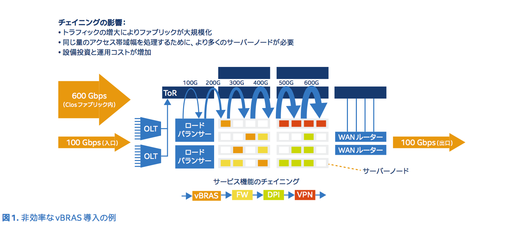
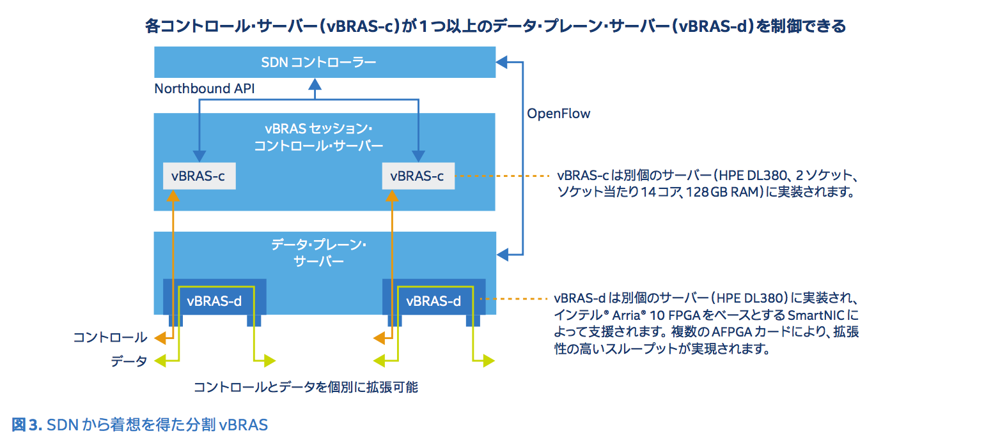
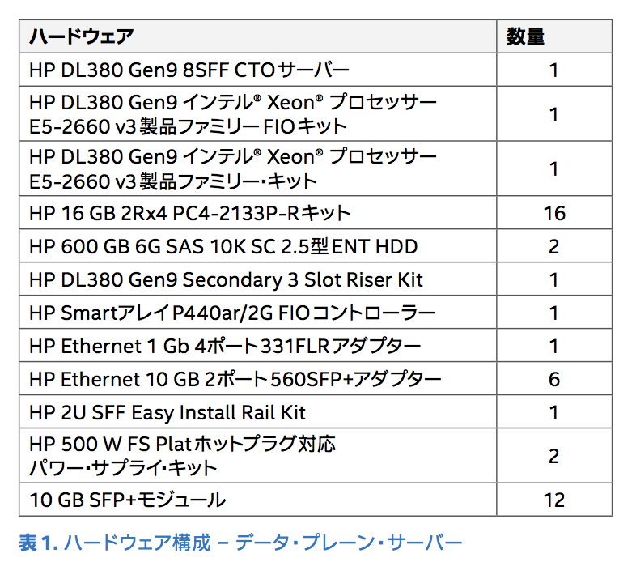
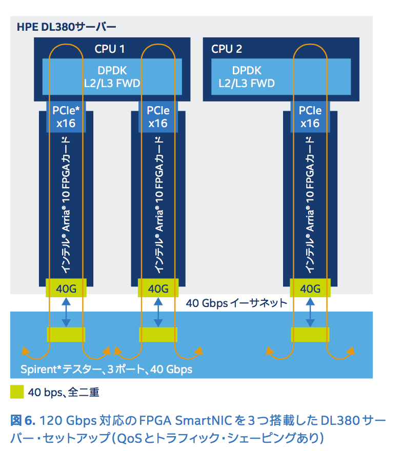
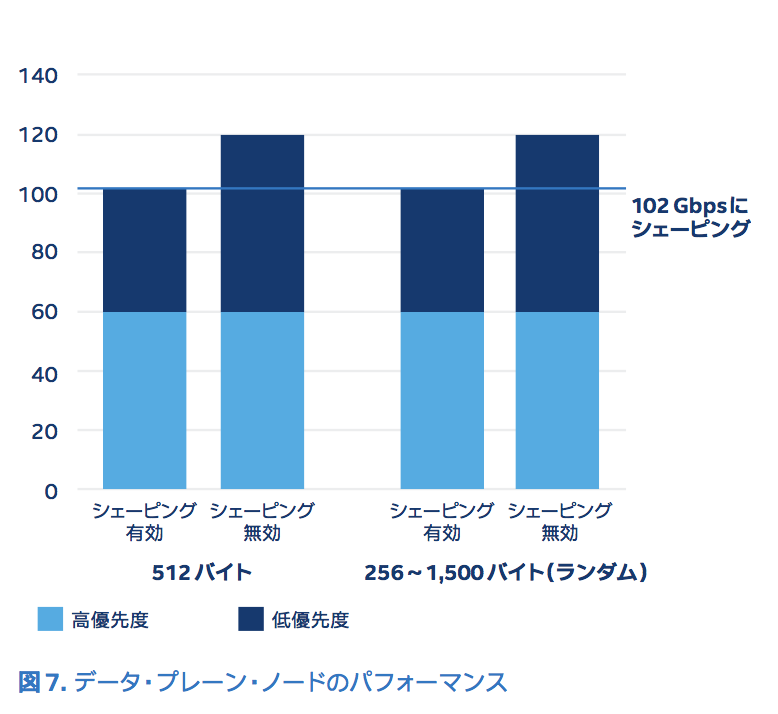
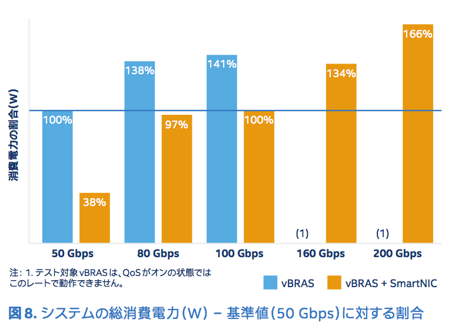
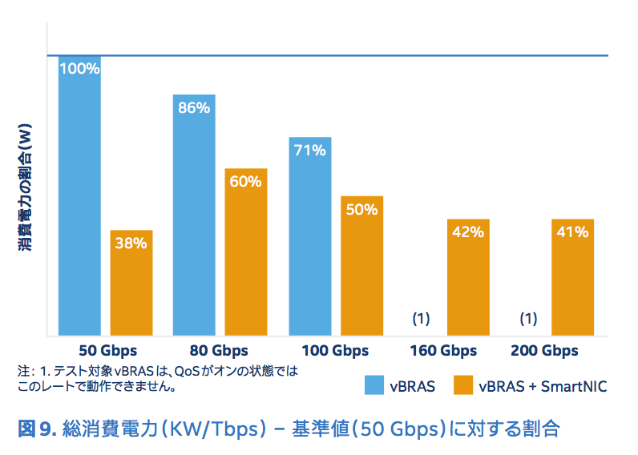
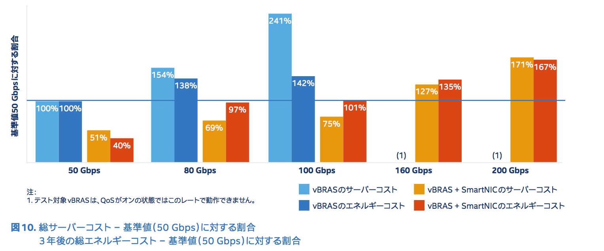
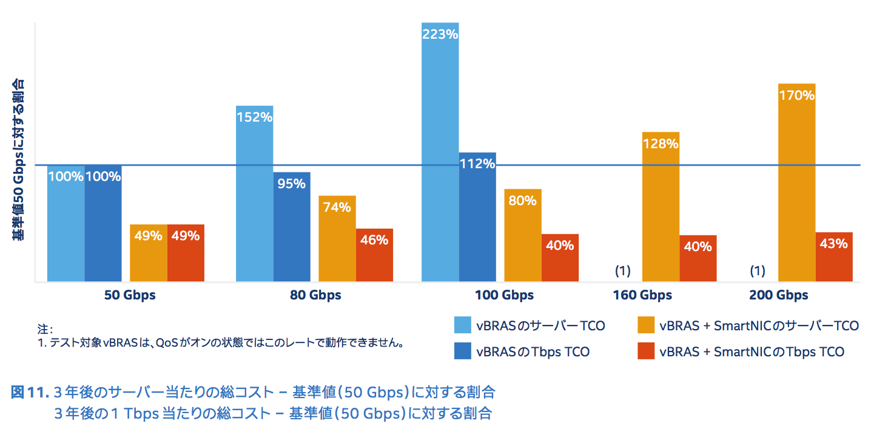
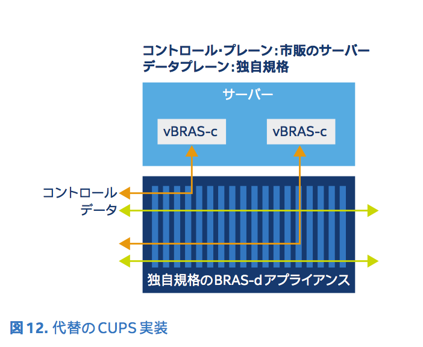

# 次世代の通信インフラストラクチャーに対応する効率的な仮想ネットワーク機能(VNF)アーキテクチャー

- NFV Whitepaper by Intel HPE
- Hiroki SHIROKURA @slankdev
- 2018.07.30

本レポートは以下のLINKのWhitepaperをよんで筆者なりにまとめたものである
[LINK](https://www.altera.co.jp/content/dam/altera-www/global/ja_JP/pdfs/literature/wp/wp-01273-finding-an-efficient-virtual-network-function-architecture_j.pdf)


---
## はじめに

- 世界のIPトラフィックは今後の5年間で3倍になると予測
- 独自規格HWは高額であり, 拡張が容易ではない
- ITインフラ仮想化
	- 利点: 複数APPでコンピュータ資源を共有しHWコストをへらすことができる
- NFV==サービスプロバイダが真の仮想化インフラに移行するための技術
- AT&T, China TelecomなどによりNFVは勢いづいている

**本Whitepaperでは以下を行う**
- **サービスプロバイダが直面している主な問題明示**
- **相対コスト問題に対処するVNFフレームの拡張構造について説明**


---
## NWとDCの結合

China Telecom調べ
- バックボーンNW帯域消費率が過去3年で42%増加
- 大都市圏のNWトラフィックはバックボーントラフィックの1.5-2倍の割合で増加
- 加入者の需要も急激に増加: 4K/8KTV,仮想通貨,拡張現実,online strage,etc...
- モビリティ: データや接続のsrc dstはリアルタイムに変化しより複雑に
- IoTによりインターネット上のデータ量, デバイス数が増加

**クラウド/仮想化の意義: IT機能の急拡大に効率良く対応する**

現状
- クラウドとネットワークは柔軟に連携できていない
- ネットワークの仮想化は遅れている
- ネットワークの仕事量は, アプリケーションの仕事量とは全く異なる
- 帯域増加によりCAPEX/OPEXが大幅に増加

以下の二つは同時に成長していくべきである
- クラウドテクノロジーが高度に洗練され動的になる
- SDNを用いたネットワーク構成の自動化

近年使われるサービス
- QoS/トラフィック・シェーピング
- 仮想プライベート・ネットワーク (VPN),
- ファイアウォール,
- ネットワーク・アドレス変換
- カプセル化/カ プセル化解除,
- ディープ・パケット・インスペクション(DPI),
- リアルタイム・ モニタリング


---
## 効率的なVNFの実装が不可欠

VNFとは
- 標準サーバ上で動作する仮装ネットワーク機能 (Router, BRAS, etc...)
- 独自規格で値段も高額なHWのニーズを減らす
- NFV/SDN/オーケストレーションを利用すれば運用上の複雑性は軽減する
- NFV導入の課題は全体的なCAPEX/OPEXを減らすこと
- VNFの必要性は広く認識されている

VNFの要件
- オートメーション
- オーケストレーション
- 専用HW機能より優れているもの (フレキシビリティ)

現状の問題点
- 仮想化環境に向け十分に最適化されていない
- 専用HWと比べパフォーマンスが低い
- パフォーマンス不足を克服するために必要なインフラコストの高さは変わらない
- NFVモデルはまだ新しく, コスト削減を達成するための最適化要素がたくさんある
- VNFの開発方法やアーキテクチャに関する明確なガイドライン不足は認識されていない

CUPS (Control and User Plane Separation)
- 個別の拡張が可能になる
- 帯域幅要求の急増によりDplaneのリソース効果と拡張性を高める必要がある

汎用サーバ上で動く最適化された再構成可能なDplane
- 汎用PCの使用はNFVの核となるテーマの一つ
- コントロールプレーンの拡張は簡単
- データプレーンの拡張は困難
	- 再構成可能なパケットパイプライン
	- 複雑なパケット処理に非常に高いスループットで対応できるようなシステム設計
- Dplaneは暗号化/復号処理などの高演算負荷のタスクもwirerateで実行する必要ある

VNFの隔離を最大限に高める　
- VNFのチェイニングが複雑化すると複数PCが連携する必要もある
- SFCが拡大するとNFVインフラの管理,拡張,運用はさらに難しくなる

VNFの拡大/隔離の必要性
- VMやコンテナでは1つの機能を複数のCPUで処理できる
- チェイニングが最適でなく, VNFが無秩序に拡大するとインフラの不可増大になる

VNFの拡大と隔離の必要性<br>
以下のような構成で, 「VNFが拡大」してしまうと, インフラのファブリックの
合計帯域が増加する.




---
## CTNet2025: 2025までのChinaTelecomネットワークの変革

China Telecomは次の技術が新しいNWアーキテクチャに重要だと判断した.

- SDNの実装
- 2025年までにインフラストラクチャーの80%を仮想化
- クラウドコンピューティングテクノロジーの活用
- OSSの使用

これらに不可欠なVNFはvBRAS, vPE, vEPC, vIMS, vOLTである.


---
## 拡張性と効率性の高いvBRASアーキテクチャへ

China Telecom, HPE, Intelの設計目標
- Architecture
	- CPUSを第一段階
	- クラウドネイティブ設計原則をサポート
- Efficient&performance
	- 電力消費量は4KW/Tbps
	- 各ノードは100Gbps以上
- Relative cost
	- SmartNICを用いた50%おコスト削減
	- 将来の世代に対応できる拡張性を実現する

BRASからvBRASへの進化
- 物理アプライアンス (a)
- vBRAS (b)
- CUPSの実現 (c)


前述の(c)を実現する,効率的なvBRAS設計(図4)



vBRAS-c Node
- コンテナ実装に適している
- 必要に応じて新規ユーザを追加
- vBRAS-cインスタンスがロケーションに依存しなくなる
- vBRAS-cを集中管理したり分散管理したりどちらも可能

vBRAS-d Node
- パケット処理専用のノード
- 一部のコアにパケット転送のみを割り当て
- 残りのコアに複雑なパケット処理を行わせる
- Intel Arria10 FPGA based SmartNICが使われる
- FPGAは以下の複雑なパケット処理機能を実行する
	- QoS, VPN, NAT, DPI
- FPGAには利点がある
	- 40%をQoSとシェービングに費やした場合
	- 60%を別のパケット処理に適用できる
	- デプロイ環境に合わせて機能を変えることができる
		- DPIの独自アルゴリズム
		- ストリーミングコンテンツの動的encode/decode
		- アプリケーション固有のユースケースに同じサーバを用いられる

SDNコントローラ
- vBRAS-dのみを制御する
- vBRAS-cがSDNコントローラになることもできる

Intel Arria10 FPGA based SmartNIC
- 複数の並列パケット処理パイプライン(40/100GbE以上)に対応するように構成可能
- レイテンシはASIC/ASSPで発生するレイテンシと同様
- 機能アップデートに対しハードウェアアップデートが必要ない
- 製品のアップグレードサイクルを速めることができる


ベンダに依存しないオープンエコシステム
- CUPSがこのアーキテクチャの肝
- 複数ベンダが寄与する駅システムで促進される
- 本WhitePapaerではintel HPEだが,他にも様々なベンダで構成可能
- 多数ベンダでAPI定義の協調的議論


---
## vBRASのパフォーマンス結果

- 最初にやることはvBRAS-d, vBRAS-cの分離
- SWアーキテクチャは図3に示す設計に基づいている.
- 表1に使用したHW情報を載せる



コントローラーのパフォーマンス
図5に示すセットアップでは, vBRAS-c のパフォーマンスを個別に測定
するために, ソフトウェアベースのvBRAS-dを使用しています.

コントローラの性能
- サーバの分離
	- Spirent PPPoEテストジェネレータがPPPoEセッションを10000回実行する
	- vBRAS-dを介してvBRAS-cサーバにリダイレクトされる
	- OpenFlowのpacket-inなどのトンネリングメカニズムを必要としない
	- セッションコントロールプロトコルのネイティブ機能を保持しながら
	- cplane, dplaneの分離が可能
- コントロールサーバの拡張
	- 2socket 14coreのういtの1coreの11%, RAMは1.5G
	- vBRAS-cが1万回セッションを処理可能
	- RAMを284Gにすると250万回以上のセッションを処理可能


vBRASデータプレーンの性能

スペック
- Arria10 FPGA based SmartNIC 3枚
- HPE DL380サーバ Xeon E-2660v3 2way RAM=256GB
- シェーピング・パラメーターの値: 8Mbps, 8.5Mbps, 10Mbps
- 目標はQoS120Gbps linerate
- 12000回の加入者セッションと2つのトラフィッククラス(優先度:高/低)
- 1加入者あたり5Mpbpsの高/低優先度トラフィックが生成される (合計60Gbpsずつ)
- サイズに関係なくシェーピングされたトラフィックが
  8Mbps×12,000=96Gbpsで送信されると同時に,
	シェーピングされないトラフィックが120Gbps(損失なし)で返信される.
- 図7は, 3 つのインテルArria10 FPGA SmartNICカードを搭載した
	dplaneの予備パフォーマンスを示す.
- トラフィックをシェーピングすると, 高優先度トラフィックに帯域幅が
	完全に割り当てられ, 低優先度トラフィックにはシェーピングが適用される.

データプレーンの転送性能結果
- 4,000 回のセッションの合計スループットが全セッションの最大値
  (それぞ れ 96 Gbps, 102 Gbps, 120 Gbps)内に収まることが分かった.

SmartNICの利点
- SmartNICは世代交代でより協力な物をに取り替え可能
- SmartNIC上で動く回路はそのまま新しいSmartNIC上で動作可能
- 2018年にはDL380が240Gbpsまで倍増すると見込む




これらの結果は, 分割アーキテクチャーによってコントローラーの拡張性を
向上できることを示している.

- FPGAベースのSmartNICは,QoSの高速化手段としても有望視されている.
- 今後は,ソフトウェア・ベースのvBRAS-dをFPGAと統合されて, QoSで
  完全vBRASのトラフィック・スループットを実現する取り組みが中心になるだろう


---
## 効果的なvBRASで相対コストを削減

ここでは, 以下のようなシステム上のメリットについて説明する
- 価格, パフォーマンス, 消費電力, etc...

モデルの目標とアプローチ
- 標準NICとSmartNICを比較します.
- コストに影響を与えるのは消費電力, サーバーコストである
- 同じ合計帯域を達成する同等のシステムを用意する
- 全体的なコスト, 消費電力を比較する

方法
- vBRASサーバーのキャパシティーを変え(50G~200G),
  サーバー・パフォーマンスは一定を保つよう試み,
	SmartNICを使用する場合と使用しない場合でコストをモデル化する.
- 分析の結果,パフォーマンスの向上によりCPUサイクルが節約され,
  コア数が減ることが分かりました.
- 図8,9,10,11は,標準NICとSmartNICで以下を比較したもの
  - 消費電力, サーバーコスト, システムコスト, 総コスト
- 結果は,50Gbpsの基準帯域幅に対する割合で示されています.

結果の要約:
- SmartNICソリューションは,標準NICサーバーと比べて総消費電力が最大50%低下
- 絶対値では,このソリューションは4KW/Tbpsの設計目標内に十分収る
- Intel Arria10FPGA based SmartNICと市販のサーバーCPUを組み合わせると,
  データプレーンのパフォーマンスが最適化され,
	高い柔軟性を維持しながらコストを削減できます.
- SmartNICを使用すると,各サーバーのパフォーマンス向上が3倍を超えます.
  スループットを向上させるには,汎用サーバのみでは無理.
- SmartNICを使用することで,パフォーマンスが向上し,
  消費電力とコストの増加分を極力抑えつつ,高帯域がサポートされます.






```
「NFVを利用することで,デバイスの機能は今後,高額な専用ハードウェアに
  頼る必要はなくなります.安価なx86ベースのシステムで,機器投資コストを
  削減し,新しいアプリケーションを短期間で開発・導入できるようになります」

	-—ChinaTelecom
```
ほんとうか?...(slankdevの意見)


---
## 他のCUPS実装との比較

欠点がたくさんある
- 図12に,vBRASソリューションの代替となる別のCUPS実装を示す
- vBRAS-cは市販の標準サーバーを使用する.
- データプレーンは独自規格のシャーシを使用します.
- 既存の製品やビジネスへの投資を維持するために
- このソリューションはオープンでもプログラム可能でもありません.
- サードパーティーのベンダーはデータプレーンを利用できない
- プロバイダーは標準ハードウェアを使用して帯域幅を拡張することができない
- さらに,独自規格のシャーシ/ラインカードを使用している
- ベンダーが固定されるリスクもある

一方で本Whitepaperで提案するアーキテクチャは...
- 純粋なサーバーベースのプラットフォーム.
- vBRAS-cとvBRAS-dを個別に拡張できます.
- ベンダーに依存しないc/d-Nodeの両方が標準ハードウェアをベースにしている
- 図12に示すような制約がありません.
- 演算負荷の高いパケット処理用にデータプレーンのスループットを
  さらに高めるため,新しいSmartNICを採用しています.




---
## まとめ

- サービスの集中に伴い,  ネットワーク機器はより複雑になった
- 新規ビジネスの導入サイクルは以下によりかつてないほど延長する
	- 機器が高度に特殊化
	- HW/SWの結び付きが強まり
	- 拡張が難しくなり
	- アップグレードサイクルが長くなり,
- 仮想NWの再設計によって,サービス導入コストは削減され,効率性は向上します.
	- 以下をリソースプールから利用することが可能
		- ビジネスルール
		- ネットワーク機能,
		- インフラストラクチャー
- ここで紹介した 新しいアーキテクチャーは, SDN/NFVを融合したもの
- クラウドとネットワークが結合され, 未来のDCがネットワークの核となる
- 完全に仮想化されたインフラストラクチャーに移行すると以下が可能に
  - 発展する市場の需要に容易に対応できる
  - 設備投資と運用コス トを減らして全体的なコストを抑える


